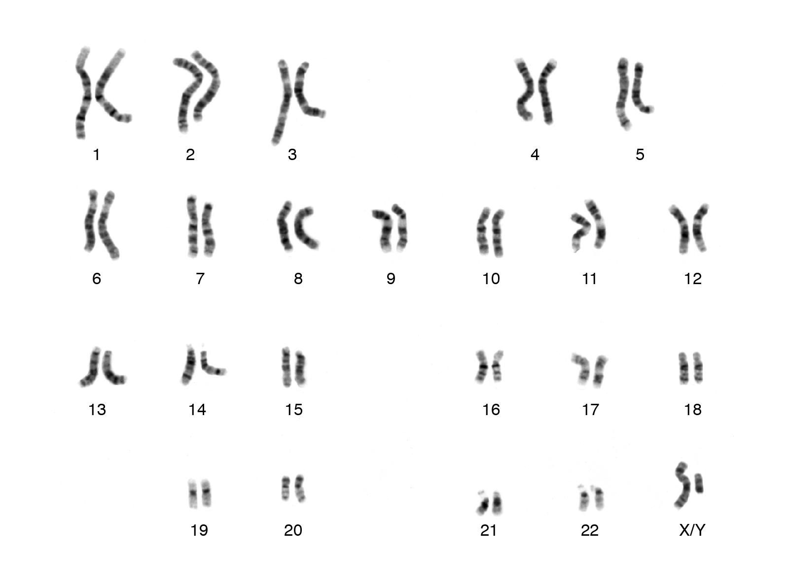
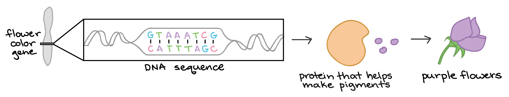
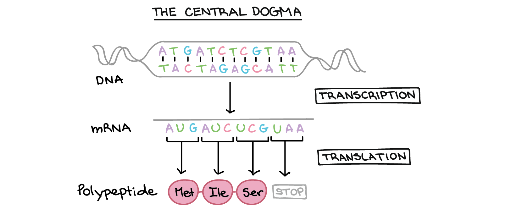
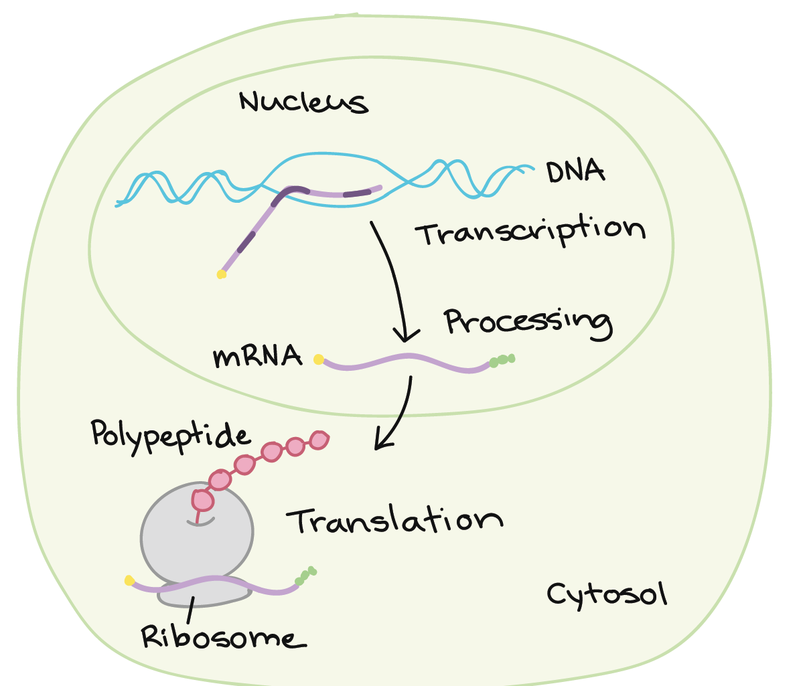
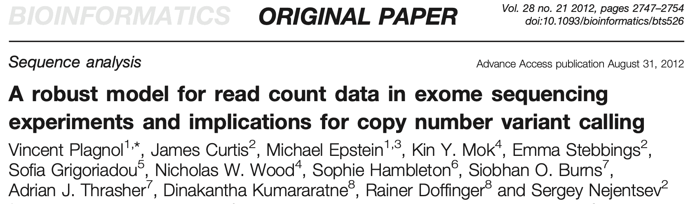
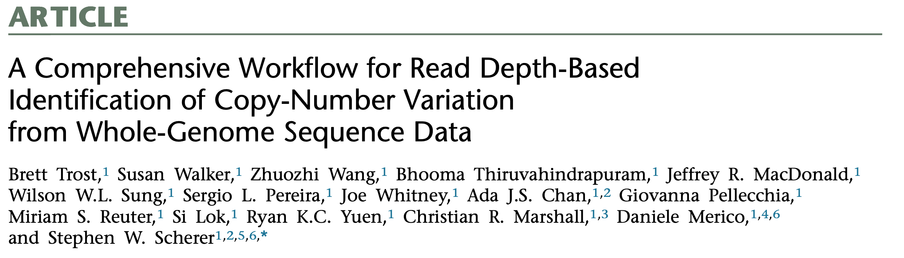
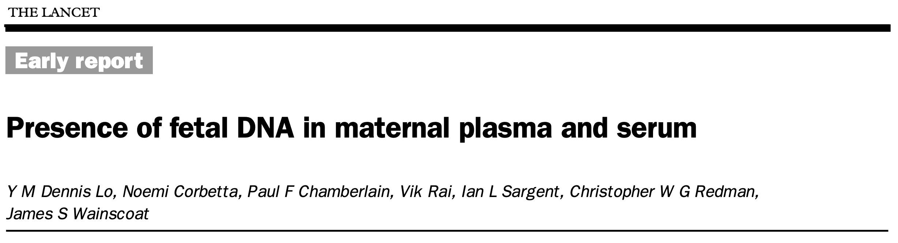
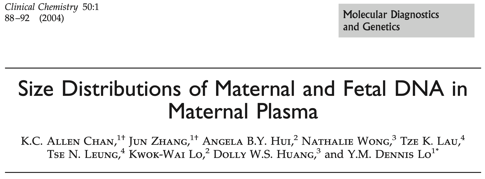
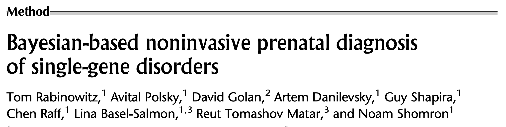

```{r loadPckgs, include=FALSE, warning=FALSE, message=FALSE, results='hide'}
library(knitr)
library(readxl)
library(data.table)
library(filer2020A)
library(filer2020B)
library(kableExtra)
library(grid)
library(eulerr)
library(dlfUtils)
library(MASS)

uncblue <- "#4B9CD3"
uncnavy <- "#13294B"
uncblck <- "#151515"
uncpink <- "#EF426F"
uncteal <- "#00A5AD"
uncyllw <- "#FFD100"
uncgren <- "#C4D600"
uncpine <- "#00594C"
uncsand <- "#F4E8DD"
uncslte <- "#4F758B"
```


```{r knitr-options, include = FALSE}
options(knitr.graphics.auto_pdf = TRUE)
knitr::opts_chunk$set(
  echo      = FALSE,
  warning   = FALSE,
  message   = FALSE,
  error     = FALSE,
  cache     = TRUE,
  fig.align = "center",
  fig.width = 4,
  fig.height = 2.5,
  dev.args = list(pdf = list(pointsize = 10)),
  dpi = 300
)
```

```{r loadObjects, cache=FALSE, results='hide'}
rdbFls <- list.files("../_bookdown_files/DLFilerDissertation_cache/latex/", 
                     pattern = ".rdb$",
                     full.names = TRUE)
rdbFls <- sub(".rdb$", "", rdbFls)
sapply(rdbFls, lazyLoad, envir = globalenv())
```

### Talk Outline 

\label{maintoc}
\tableofcontents

# One-minute primer on human genetics

## Genetic material organized into chromosomes

### Genetic material organized into chromosomes

\centering
{width=80%}

\vfill
\tiny
(Image taken from NHGRI)

## Central dogma of molecular biology

### Central dogma of molecular biology

\centering


\vfill
\tiny
(Image taken from Khan Academy)

### Central dogma of molecular biology

\centering


\vfill
\tiny
(Image taken from Khan Academy)

### Central dogma of molecular biology

\centering
{width=50%}

\vfill
\tiny
(Image taken from Khan Academy)

# Copy number variation in exome sequencing

## Background and motivation

### What is a copy number variant?

\centering


### Motivation

\centering


\bigskip

> Our analysis identified 2844 intragenic CNVs in 384 clinically tested genes. CNVs were observed in 1.9% of the entire cohort but in a disproportionately high fraction (9.8%) of individuals with a clinically significant result.

### Motivation

\centering

```{r truty}
truty <- as.data.table(read_xlsx("/Users/dayne/papers/truty2019aa00.xlsx"))
setnames(truty, gsub(" ", "_", names(truty)))
tdat <- truty[ , .N, by = .(CNV_size, Variant_type)]
tdat[CNV_size == "Whole gene", CNV_size := "wholeGene"]
tdat[CNV_size == "partialExon", CNV_size := "partExon"]
setkey(tdat, CNV_size)
ordr <- c("wholeGene", "multiExon", "singleExon", "partExon", "promoter")
tdat <- tdat[J(ordr)]

par(mfrow = c(1, 2), mar = c(6, 3, 3, 1))
ordr <- c("wholeGene", "multiExon", "singleExon", "partExon", "promoter")
barplot(tdat[Variant_type == "DEL", N],
        names.arg = ordr,
        las = 2,
        axes = FALSE,
        ylim = c(0, 1000),
        col = c("gray", rep(uncblue, 3), "gray"),
        border = NA)
axis(side = 2)
mtext(side = 3, line = 1.5, "Deletions", col = uncblue, font = 2)
barplot(tdat[Variant_type == "DUP", N],
        names.arg = ordr,
        las = 2,
        axes = FALSE,
        ylim = c(0, 1000),
        col = c("gray", rep(uncnavy, 3), "gray"),
        border = NA)
axis(side = 2)
mtext(side = 3, line = 1.5, "Duplications", col = uncnavy, font = 2)
```

## Better capturing the exome

### Why exome sequencing?

* Only 1-2% of our DNA codes for protein (exome)

* Sequencing only the exome is cost-efficient and easier to interpret

\bigskip

\centering
{height=50%}

### Exon-to-exon capture variation

```{r exonCapVar}
data(subjectCounts)
exonCts <- subjectCounts[ , `IDT-IC;NCG_00169`]
exonCts <- pmin(exonCts, quantile(exonCts, 0.99, na.rm = TRUE))
par(mar = c(4, 1, 1, 1))
hist(exonCts, breaks = 50, col = uncblue, 
     border = NA, ann = FALSE, axes = FALSE)
title(xlab = "Counts per exon")
axis(side = 1)
```

### The current state-of-the-art: ExomeDepth

\centering

\raggedright

* ExomeDepth builds a comparative model based on the beta-binomial distribution

* Begins by finding highly-correlated samples to build a control vector

* Defaults to an expected CNV size of 50kb -- not expected to perform well for small (exon level) variation

### Can we better capture exomes?

\centering


### Can we better capture exomes?

\centering

```{r poolTbl}
kable(poolTbl[ , .(pool, capture, N, medExon, medTotal, rsdTotal)], 
      row.names = FALSE, 
      format.args = list(big.mark = ",", scientific = FALSE),
      booktabs = TRUE,
      escape = FALSE,
      linesep = "")
```

### Can we better capture exomes?

```{r a0plt}
pltAlpha0(a0tbl, mcCol = uncblue, icCol = uncnavy)
```

### Can we better capture exomes?

```{r aglMnVr}
aglPools <- c(sprintf("randNCG_%d", 1:5), "Pool1", "Pool2", "WGS", "SMA1", "SMA2")
with(mnvr[pool %in% aglPools], {
  pltMnVrCont(dat = as.data.table(as.list(environment())),
              grpVec = factor(pool, levels = aglPools),
              colVec = c(rep(uncnavy, 5), rep(uncblue, 5)),
              lgnd = FALSE)
})
```

### Can we better capture exomes?

```{r idtMnVr}
idtPools <- c("IDT-MC", "IDT-IC", "IDT-RR")
with(mnvr[pool %in% idtPools], {
  pltMnVrCont(dat = as.data.table(as.list(environment())),
              grpVec = factor(pool, levels = idtPools),
              colVec = c(uncblue, uncnavy, uncblue),
              lgnd = FALSE)
})
```

### Can we better capture exomes?

```{r nSelected}
pltSubjectStatByPool("nSelected", ylab = "Number of controls selected")
```

### Can we better capture exomes?

```{r propSelected}
pltSubjectStatByPool("propSelected", ylab = "Proportion of controls selected")
```

### Can we better capture exomes?

```{r overallPhi}
pltSubjectStatByPool("overallPhi", ylab = "Overdispersion (phi)")
```

### Can we better capture exomes?

\bigskip
\centering\Huge\textcolor{uncnavy}{Yes!}

\bigskip
\raggedright\normalsize

#### We recommend

1. Multiplexing roughly 16 samples prior to exome capture

2. Checking for library balance prior to exome capture (from our limited data, we suggest RSD 30%)

## Novel copy number variant algorithm

### Can we better analyze exomes?

#### mcCNV algorithm

\medskip

1. Assumes multiplexed capture
2. Models observed counts using the negative binomial model
3. Uses a shrinkage estimator for the dispersion

\medskip

\hfill {width=30%}

### Can we better analyze exomes?

```{r simResMCC, fig.height=2.5, fig.width=2.5, fig.show='hold', out.width='49%'}
pltStatCompare(xRes = procSimRes$ExomeDepthDefault, yRes = procSimRes$mcCNV,
               stat = "mcc", xlab = "ExomeDepth (default)", ylab = "mcCNV")
pltStatCompare(xRes = procSimRes$ExomeDepthBest, yRes = procSimRes$mcCNV,
               stat = "mcc", xlab = "ExomeDepth (correct)", ylab = "mcCNV")
```

### Can we better analyze exomes?

```{r simResTPR, fig.height=2.5, fig.width=2.5, fig.show='hold', out.width='49%'}
pltStatCompare(xRes = procSimRes$ExomeDepthDefault, yRes = procSimRes$mcCNV,
               stat = "tpr", xlab = "ExomeDepth (default)", ylab = "mcCNV")
pltStatCompare(xRes = procSimRes$ExomeDepthBest, yRes = procSimRes$mcCNV,
               stat = "tpr", xlab = "ExomeDepth (correct)", ylab = "mcCNV")
```

### Can we better analyze exomes?

```{r simResFDR, fig.height=2.5, fig.width=2.5, fig.show='hold', out.width='49%'}
pltStatCompare(xRes = procSimRes$ExomeDepthDefault, yRes = procSimRes$mcCNV,
               stat = "fdr", xlab = "ExomeDepth (default)", ylab = "mcCNV")
pltStatCompare(xRes = procSimRes$ExomeDepthBest, yRes = procSimRes$mcCNV,
               stat = "fdr", xlab = "ExomeDepth (correct)", ylab = "mcCNV")
```

### Can we better analyze exomes?

\centering

\raggedright

* Combines calls from two algorithms: ERDS and CNVnator

* Excludes repetitive and low-complexity regions (RCLRs)

* Followed their recommendations, and removed all exons overlapping their defined RLCRs

### Can we better analyze exomes?

\scriptsize

```{r wgsCallBySbj}
kable(wgsCallBySbj,
      col.names = c("subject", rep(c("MC", "ED", "WG"), 3)),
      row.names = FALSE, 
      format.args = list(big.mark = ",", scientific = FALSE),
      booktabs = TRUE,
      linesep = "") %>%
  kable_classic() %>%
  add_header_above(c(" " = 1, "Total" = 3, "Duplications" = 3, "Deletions" = 3))
```

### Can we better analyze exomes?

\scriptsize

```{r predMetricTbl}
predMetrics[ , typ := rep(c("ALL", "DUP", "DEL"), each = 4)]
predMetrics[ , set := ifelse(grepl("Sub", PredSet), "Sub", "Total")]
predMetrics[ , alg := ifelse(grepl("mc", PredSet), "MC", "ED")]
setcolorder(predMetrics, c("typ", "set", "alg"))
kable(predMetrics[ , .(typ, set, alg, MCC, TPR, FDR, PPV)],
      col.names = c(rep("", 3), "MCC", "TPR", "FDR", "PPV"),
      row.names = FALSE, 
      format.args = list(big.mark = ",", scientific = FALSE),
      booktabs = TRUE,
      linesep = "") %>%
  kable_classic() %>%
  collapse_rows(columns = 1:2, valign = "middle", latex_hline = "major") %>%
  row_spec(predMetrics[ , which(set == "Sub")], background = "gray85") %>%
  column_spec(1, background = "uncgray")
```

### Can we better analyze exomes?

```{r vennSub, fig.show='hold', out.width='49%',fig.width=3, fig.height=3}
vennCol <- sapply(c(uncblue, uncnavy, "gray80"), col2alpha)
eulerr_options(fills = list(fill = vennCol), quantities = list(cex = 0.5))
plot(ctsSubDup, quantities = TRUE, labels = FALSE, main = "")
grid.text("DUPLICATIONS", x = 0.5, y = 0.9)
plot(ctsSubDel, quantities = TRUE, labels = FALSE, main = "")
grid.text("DELETIONS", x = 0.5, y = 0.9)
```

```{r vennLgnd, fig.width=4,fig.height=0.5}
par(mar = rep(0, 4))
plot.new()
legend("center", legend = c("MC", "ED", "WG"), 
       fill = vennCol, horiz = TRUE, bty = "n")
```

### Can we better analyze exomes?

\bigskip
\centering\Huge\textcolor{uncnavy}{Possibly...}

\bigskip
\raggedright\normalsize

* Found comparable performance overall to ExomeDepth

* However! We do not require prior information

\hfill {width=30%}

# Detecting fetal variation from cell-free DNA

## Background

### Cell-free DNA used for fetal genetic testing

\centering 

\raggedright
#### Noninvasive testing can now detect:

* aneuploidy and large chromosomal deletions (>5Mb)

* autosomal dominant single-gene disorders

* autosomal recessive single-gene disorders using relative haplotype dosing (RHDO)

### Motivation

\centering

***No one has demonstrated accurate fetal genotyping from cell-free DNA without additional parental sequencing***

\bigskip\bigskip\raggedright

Fetal genotyping using only cell-free DNA would 

1. enable population-level screening for Mendelian disorders, allowing immediate neonatal management;

2. provide more targets for developing *in utero* therapies. 

### The two estimation problems


### Estimating fetal fraction

Represent maternal and fetal genotype pairs with capital and lowercase letters, where 'A' and 'B' represent the major and minor alleles (e.g. 'AAab' represents the fetus uniquely heterozygous for the minor allele). Define the fetal fraction and PMAR as the random variables $F$ and $M$.

\begin{align}
\text{E}[M \rvert G = \text{AAab}, F = f] &= \frac{f}{2} \\
\text{E}[M \rvert G = \text{ABaa}, F = f] &= \frac{1 - f}{2} \\
\text{E}[M \rvert G = \text{ABab}, F = f] &= \frac{1}{2} \\
\text{E}[M \rvert G = \text{ABbb}, F = f] &= \frac{1 + f}{2} \\
\text{E}[M \rvert G = \text{BBab}, F = f] &= 1 - \frac{f}{2} 
\end{align}

### Estimating fetal fraction

```{r genoLgnd, fig.width = 6, fig.height = 0.5, fig.show='hide'}
par(mar = rep(0, 4))
plot.new()
legend(x = grconvertX(0.5, from = "nfc"),
       y = grconvertY(0.5, from = "nfc"),
       legend = GenoMeta$name,
       horiz = TRUE,
       lwd = 4,
       col = GenoMeta$color,
       xjust = 0.5,
       yjust = 0.5,
       xpd = NA,
       bty = "n")
```

```{r expMaf250}
pltExpMAF(250)
```

\centering 

## Novel maternal-fetal genotyping algorithm

### Novel maternal-fetal genotyping algorithm

* Perform empirical Bayes EM routine to identify unique fetal heterozygosity

* Estimate fetal fraction as the median across all sites with fetal heterozygosity

* Estimate maternal-fetal genotypes as the maximal-likelihood given the fetal fraction estimate

## Shortcomings of noninvasive exome sequencing

### Applying genotyping algorithm to cell-free exome sequencing

\scriptsize

\begin{table}
\centering
\begin{tabular}[t]{ll>{\raggedright\arraybackslash}p{8em}>{\raggedright\arraybackslash}p{8em}rrrr}
\toprule
  & GA & Clinical findings & Genetic diagnosis & FF & Dep & \%Dup & \%Filt\\
\midrule
1 & 32w2d & 5 prior pregnancies affected with X-linked recessive Menke's syndrome & Menke's syndrome; del. ATP7A exon 1 & 0.117 & 241 & 42.80 & 21.96\\
2 & 24w5d & Fetal sonogram at 21w5d showed femoral bowing with shortened length (\textless3\% for GA) bilaterally & Osteogenesis imperfecta type VIII; P3H1 c.1120G\textgreater T (rs140468248) & 0.122 & 152 & 33.32 & 22.09\\
3 & 34w0d & Fetal sonogram at 19w0d showed bilateral club foot with bilateral upper limb arthrogryposis & None, to date, despite exome and genome sequencing of newborn & 0.169 & 330 & 53.67 & 32.65\\
\bottomrule
\end{tabular}
\end{table}

### Applying genotyping algorithm to cell-free exome sequencing

```{r alleleDepCase1}
with(gt[use & smp == "S1"], cfPltFreqHist(alt, udep, gtCall, ff = ff[1]))
title(ylab = "Case 1", line = 1)
```

\centering 

### Applying genotyping algorithm to cell-free exome sequencing

```{r alleleDepCase2}
data(rs140468248)
data(GenoMeta)
with(gt[use & smp == "S2"], cfPltFreqHist(alt, udep, gtCall, ff = ff[1]))
oiCall <- gt[varid == rs140468248, gtCall]
oiPmar <- gt[varid == rs140468248, alt/(ref + alt)]
abline(v = oiPmar, col = GenoMeta$color[GenoMeta$name == oiCall])
text(x = oiPmar,
     y = grconvertY(0.75, "nfc"),
     "rs140468248",
     srt = 90,
     adj = c(0.5, 1.5),
     col = GenoMeta$color[GenoMeta$name == oiCall])
title(ylab = "Case 2", line = 1)
```

\centering 

### Applying genotyping algorithm to cell-free exome sequencing

```{r alleleDepCase3}
with(gt[use & smp == "FES-0034-4"], cfPltFreqHist(alt, udep, gtCall, ff = ff[1]))
title(ylab = "Case 3", line = 1)
```

\centering 

### Applying genotyping algorithm to cell-free exome sequencing

* In Case 3, we also have individual exome sequencing for the mother, father, and fetus

* Overall, we found a 50.91% genotyping accuracy

\bigskip

```{r c3FetByCfTbl}
kable(c3FetByCf[ , .(" " = "Fetal", " " = fet, `0/0`, `0/1`, `1/1`)], 
      row.names = FALSE,
      format.args = list(big.mark = ",", scientific = FALSE),
      booktabs = TRUE) %>%
  kable_classic() %>%
  collapse_rows(columns = 1, valign = "middle") %>%
  add_header_above(c(" " = 2, "Cell-free" = 3))
```

### Explaining the poor performance

```{r binCI}
pltExpMAF(500)
```

### Explaining the poor performance

```{r binWeitz, fig.height=3}
pltMissclass()
```

### Does fragment length matter?

\centering 

\bigskip

\centering 

### Does fragment length matter?

```{r matVsFetLen, fig.width=4.5, fig.height=3}
## Calculate density and ECDF for fragment read lengths
matDen <- density(c3MatFetReads[source == "maternal", isize])
fetDen <- density(c3MatFetReads[source == "fetal",    isize])
matCdf <- ecdf(c3MatFetReads[source == "maternal", isize])
fetCdf <- ecdf(c3MatFetReads[source == "fetal",    isize])

## Generate plots
par(mfrow = c(1, 2), oma = c(3, 0, 0, 0))
par(mar = c(4, 2, 1, 1))
plot.new()
plot.window(xlim = range(c(matDen$x, fetDen$x)), range(c(matDen$y, fetDen$y)))
lines(matDen, col = uncnavy, lwd = 2)
lines(fetDen, col = uncblue, lwd =2)
axis(side = 1)
title(xlab = "Fragment length")
title(ylab = "Density", line = 1)
par(mar = c(4, 4, 1, 1))
plot.new()
xv <- seq(50, 300, 1)
plot.window(xlim = range(xv), ylim = 0:1)
points(x = xv, y = matCdf(xv), col = uncnavy, lwd = 2, type = "l")
points(x = xv, y = fetCdf(xv), col = uncblue, lwd = 2, type = "l")
axis(side = 1)
axis(side = 2)
title(xlab = "Fragment length (insert size)",
      ylab = "Cumulative distribution")
legend(x = grconvertX(0.5, from = "ndc"),
       y = line2user(2, side = 1, outer = TRUE),
       legend = c("Maternal", "Fetal"),
       horiz = TRUE,
       lwd = 2,
       col = c(uncnavy, uncblue),
       xjust = 0.5,
       yjust = 0.5,
       xpd = NA,
       bty = "n")
```

### Does fragment length matter?

```{r sratioByPmar, fig.show='hold', fig.height=3, fig.width=2.5, out.width='32%'}
gt[ , pmar := alt/(alt + ref)]
gt[ , sratio := sdep/adep]
pltSratioByPmar <- function(smpNm) {
  par(mar = c(4, 4, 2, 1))
  with(gt[gtCall == "AAab" & smp == smpNm], {
    plot(pmar ~ sratio,
         xlab = "Proportion < 140 bp",
         ylab = "PMAR",
         pch = 16,
         cex = 0.5,
         col = col2alpha('darkgray'),
         bty = "n")
  })
  with(gt[gtCall == "AAab" & smp == smpNm], {
    contour(kde2d(x = sratio, y = pmar, n = 500),
            nlevels = 25,
            add = TRUE,
            drawlabels = FALSE,
            col = uncnavy)
  })
}
pltSratioByPmar("S1")
title(main = "Case 1", line = 1)
pltSratioByPmar("S2")
title(main = "Case 2", line = 1)
pltSratioByPmar("FES-0034-4")
title(main = "Case 3", line = 1)
```

\bigskip

* Rabinowitz et al. found the difference in accuracy varied from -0.25% to 1.89% when using versus not using fragment length in their exome analyses.

* Correcting for fragment length will not overcome the bounds of the binomial distribution

### Summary

* Noninvasive exome sequencing would require cost-prohibitive sequencing depths

* Despite suggestions by others, simply correcting for fragment length will not facilitate noninvasive genome/exome sequencing in the clinic

* We recommend a more targeted approach

## Acknowledgments {-}

\begin{minipage}[t]{0.49\linewidth}
\begin{itemize}\scriptsize
  \item Kirk Wilhelmsen
  \begin{itemize}\scriptsize
    \item Fenshen Kuo
    \item Chris Bizon
    \item Jeff Tilson
    \item Darius Bost
    \item Kimberly Robasky
    \item Phil Owen
  \end{itemize}
  \item Thesis Committee
  \begin{itemize}\scriptsize
    \item Bradford Powell (Chair)
    \item Stan Ahalt
    \item Yun Li
    \item Neeta Vora
  \end{itemize}
  \item Jonathan Berg
  \begin{itemize}\scriptsize
    \item Christian Tilley
    \item Alicia Brandt
  \end{itemize}
\end{itemize}
\end{minipage}
\begin{minipage}[t]{0.49\linewidth}
\begin{itemize}\scriptsize
  \item UNC Genetics/BCB
  \begin{itemize}\scriptsize
    \item Will Valdar
    \item Tim Elston
    \item Jonathan Cornett
    \item Cara Marlow
    \item Fernando Pardo-Manuel de Villena
  \end{itemize}
  \item MD/PhD Program
  \begin{itemize}\scriptsize
    \item Toni Darville
    \item Mohanish Deshmuk
    \item Alison Reagan
    \item Carol Herrion
    \item Amber Brosius
  \end{itemize}
\end{itemize}
\end{minipage}

\bigskip

\centering
\includegraphics[height=4em]{images/renci-logo_grey.pdf}
\hspace{2ex}
\includegraphics[height=3em]{images/SOM_gray.pdf}

\appendix 

# Appendix {-}

### Appendix

\label{apptoc}

\tableofcontents

## Median count per exon

```{r medIntMolCount}
pltSubjectStatByPool("medIntMolCount", ylab = "Median count per exon")
```

## Produce simulated exomes

\medskip

We use an alternate definition of copy state, such that 1 represents the normal diploid state.
Let $N$ represent the total number of molecules (read pairs) and $e_j \in \mathbb{E}$ represent the  probability of capturing target $j$, then for each subject, $i$:

1. Randomly select $s_{ij} \in \mathbb{S}_i$ from $S = \{0.0, 0.5, 1, 1.5, 2\}$ as the copy number at target $j$

2. Adjust the subject-specific capture probabilities by the copy number, $\mathbb{E}_i = \frac{\mathbb{E} \odot \mathbb{S}_{i}}{\sum_j \mathbb{E} \odot \mathbb{S}_{i}}$

3. Draw $N$ times from $\text{Multinomial}(\mathbb{E}_i)$, giving the molecule counts at each target $j$ for sample $i$, $c_{ij} \in \mathbb{C}_i$

## mcCNV algorithm

The mcCNV algorithm adjusts the sSEQ probability model by adding a multiplier for the copy state:
$$
  C_{ij} \sim \mathcal{NB}(f_is_{ij}\hat\mu_j, \tilde\phi_j/f_i)
$$
where the random variable $C_{ij}$ represents observed molecule counts for subject $i$ at target $j$, $f_i$ is the size factor for subject $i$, $s_{ij}$ is the copy state, $\mu_j$ is the expected mean under the diploid state at target $j$, and $\tilde\phi_j$ is the shrunken phi at target $j$.
We observe $c_{ij}$ and wish to estimate $s_{ij}$, $\hat{s}_{ij}$.

### mcCNV algorithm

Initialize by setting $\hat{s}_{ij} = 1$ for all $i,j$. Then,

1. Adjust the observed values for the estimated copy-state,
  $$
  c_{ij}^{\prime} = \frac{c_{ij}}{\hat{s}_{ij}}.
  $$

2. Subset $c_{ij}^{\prime}$ such that $c_{ij}^{\prime} > 10, ~ \hat{s}_{ij} > 0$

3. Calculate the size-factor for each subject
  $$
  f_i = \text{median}\left(\frac{c_{ij}^{\prime}}{g_j}\right),
  $$
  where $g_j$ is the geometric mean at each exon.

4. Use method of moments to calculate the expected dispersion
  $$
  \hat\phi_j = \max\left(0, \frac{\hat\sigma_j^2 - \hat{\mu}_j}{\hat{\mu}_j^2}\right)
  $$
  where $\hat{\mu}_j$ and $\hat{\sigma}_j^2$ are the sample mean and variance of $c_{ij}^{\prime}/f_i$.

### mcCNV algorithm

5. Let $J$ represent the number of targets. Shrink the phi values to
  $$
  \tilde\phi_j = (1 - \delta)\hat\phi_j + \delta\hat{\xi}
  $$
  such that
  $$
  \delta = \frac{\sum\limits_j\left(\hat\phi_j - \frac{1}{n_j}\sum\limits_j \hat\phi_j\right)^2/(J - 1)}
  {\sum\limits_j\left(\hat\phi_j - \hat{\xi}\right)^2/(n_j - 2)}
  $$
  and
  $$
  \hat{\xi} = \mathop{\text{argmin}}\limits_{\xi}\left\{
  \frac{d}{d\xi}\frac{1}{\sum\limits_j \left(\hat\phi_j - \xi\right)^2}
  \right\}.
  $$

### mcCNV algorithm

6. Update $\hat{s}_{ij}$,
  $$
  \mathop{\text{argmax}}\limits_{s \in S}\left\{
  \mathcal{L}(s \rvert c_{ij},f_i,\hat\mu_j,\tilde\phi_j)
  \right\}
  $$
  where $S = \{0.001, 0.5, 1, 1.5, 2\}$.

7. Repeat until the number of changed states falls below a threshold or a maximum number of iterations is reached.

8. After convergence, calculate p-values for the diploid state, $\pi_{ij} = \text{Pr}(s_{ij} = 1)$.

9. Adjust p-values using the Benjamini–Hochberg procedure and filter to a final call-set such that adjusted p-values fall below some threshold, $\alpha$.


## Venn diagrams with all samples

```{r vennAll, fig.show='hold', out.width='49%',fig.width=3, fig.height=3}
eulerr_options(fills = list(fill = vennCol), quantities = list(cex = 0.5))
plot(ctsAllDup, quantities = TRUE, labels = FALSE, main = "")
grid.text("DUPLICATIONS", x = 0.5, y = 0.9)
plot(ctsAllDel, quantities = TRUE, labels = FALSE, main = "")
grid.text("DELETIONS", x = 0.5, y = 0.9)
```

\centering 

## Aglient capture versus IDT capture

```{r mnVrComp}
with(mnvr[pool %in% c("WGS", "IDT-RR")], {
  pltMnVrCont(dat = as.data.table(as.list(environment())),
              grpVec = factor(pool, levels = c("WGS", "IDT-RR")),
              colVec = c("darkblue", "darkorange"))
})
```

## Maternal-fetal genotyping algorithm

Represent maternal and fetal genotype pairs, given by the random variable $G$, with capital and lowercase letters, where 'A' and 'B' represent the major and minor alleles (e.g. 'AAab' represents the fetus uniquely heterozygous for the minor allele).

Let $X,Y$ be random variables for major and minor allele read counts.
Define the fetal fraction and PMAR as the random variables $F$ and $M$.

We employ an empirical Bayesian expectation-maximization algorithm to identify loci with unique fetal heterozygosity, i.e. $g \in \{\text{AAab}, \text{BBab}\}$.
We pick reasonable starting values for the fetal fraction, $F = f$, and the average minor allele frequency, then iteratively update the expected allele distribution and expected PMAR values until some convergence:

### Maternal-fetal genotyping algorithm

1. Initialize the genotype probabilities, $p_g^* = \text{Pr}\{G = g\}$, and the expected PMAR, $m_g^* = m_g$, based on reasonable estimates for the average minor allele frequency and fetal fraction

2. Update $\hat{\mathbb{G}}$:
  $$
    \hat{g}_i = \mathop{\text{argmax}}\limits_{g \in G}\left\{p_g^*\mathcal{L}(g \rvert m_g^*,x_i,y_i)\right\}, Y_{i} \sim \text{Bin}(x_i + y_i, m_g^*) 
  $$

3. Update the genotype probabilities:
  $$
    p_g^* = \frac{\sum_i \text{I}(\hat{g} = g) + N\text{Pr}\{G = g\} - 1}{\sum_g\left\{\sum_i \text{I}(\hat{g} = g) + N\text{Pr}\{G = g\} - 2\right\}}
  $$
  where $N$ is the weight given to the initial estimate of the genotype probability, $\text{Pr}\{G = g\}$.

### Maternal-fetal genotyping algorithm

4. Update the expected PMAR:
  $$
    m_g^* = \frac{\sum_i y_i\text{I}(\hat{g} = g) + Nm_g - 1}{\sum_i(x_i + y_i)\text{I}(\hat{g} = g) + N - 2} 
  $$
  where $N$ is the weight given to the initial estimate of the PMAR, $m_g$.

5.  Continue updating $\hat{\mathbb{G}}$ , $p_g^*$, and $m_g^*$ until $\hat{\mathbb{G}}$ converges.

6.  For all loci $j$, such that $\hat{g} \in \{\text{AAab}, \text{BBab}\}$, calculate $\hat{f}_j$:
  $$
    \hat{f}_j =
      \begin{cases}
        \displaystyle\frac{2y_j}{x_j + y_j}, & \hat{g} = AAab \\[15pt]
        2 - \displaystyle\frac{2y_j}{x_j + y_j}, & \hat{g} = BBab
      \end{cases} 
  $$
  
### Maternal-fetal genotyping algorithm

7.  Let
  $$
    \hat{f} = \text{median}\left(\hat{f}_j\right)
  $$

8. Calculate the expected PMAR using the fetal fraction estimate,
  $$
    m_g = \text{E}[M|\hat{f},g]
  $$

9. Finally, for all loci, $i$, estimate $\hat{g}_i \in \hat{\mathbb{G}}$,
  $$
  \hat{g}_i = \mathop{\text{argmax}}\limits_{g \in G}\left\{\mathcal{L}(g \rvert m_g,x_i,y_i)\right\}, Y_{i} \sim \text{Bin}(x_i + y_i, m_g)
  $$


## All case 3 calls

```{r makeCallTbl}
makeCallTbl <- function(tbl) {
  kable(tbl, 
        row.names = FALSE,
        format.args = list(big.mark = ",", scientific = FALSE),
        booktabs = TRUE,
        linesep = "") %>%
    kable_classic() %>%
    collapse_rows(columns = 1:2, valign = "middle", latex_hline = "major") %>%
    row_spec(tbl[ , which(Fet == "0/1")], background = "gray85") %>%
    column_spec(1, background = "uncgray")
}
```

\begin{minipage}{0.49\linewidth}
```{r c3CallsHom}
makeCallTbl(c3Calls[mat %in% c("0/0", "1/1"),
                    .(Mat = mat, Fet = fet, Cff = cff, N)])
```
\end{minipage}
\begin{minipage}{0.49\linewidth}
```{r c3CallsHet}
makeCallTbl(c3Calls[mat == "0/1", .(Mat = mat, Fet = fet, Cff = cff, N)])
```
\end{minipage}
